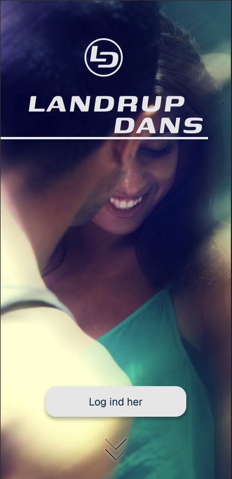
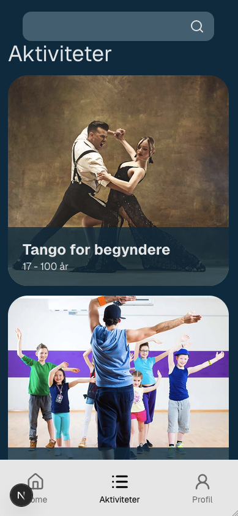
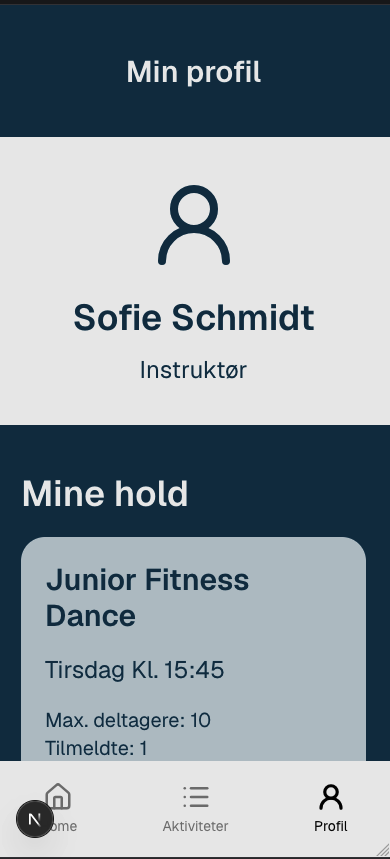

# Landrup Dans

En mobil-først webapplikation for en danseskole. Brugere kan finde hold, se holdoplysninger og administrere deres tilmeldinger. Instruktører kan se deres egne hold og deltagerlister.

Projektet er udviklet som et selvstændigt portfolio-projekt af [ReedorReed](https://github.com/ReedorReed).



## Funktioner

- Søgning og filtrering af aktiviteter efter navn eller ugedag
- Dynamiske detaljesider for hvert hold
- Login med rollebaseret adgang for medlemmer og instruktører
- Tilmelding og afmelding med validering af alder, kapacitet, dubletter og hold på samme ugedag
- Profilside med tilmeldte hold eller instruktørens deltagerlister
- Kontaktformular og tilmelding til nyhedsbrev med klientvalidering og tydelig feedback

## Teknologier

- Next.js 16 og React 19
- TypeScript
- Tailwind CSS 4
- Zod til formularvalidering
- Server Actions og httpOnly-cookie-baseret session
- REST API-integration

## Udvalgte skærmbilleder

| Aktiviteter | Profil |
| --- | --- |
|  |  |

## Lokal opsætning

Projektet bruger Bun som package manager og kræver adgang til det tilhørende API.

```bash
git clone https://github.com/ReedorReed/landrup-dans-web-app.git
cd landrup-dans-web-app
bun install
cp .env.example .env.local
bun dev
```

Åbn derefter [http://localhost:3000](http://localhost:3000).

### Miljøvariabler

Sæt begge værdier i `.env.local` til API'ets base-URL. `API_URL` bruges på serveren, mens `NEXT_PUBLIC_API_URL` bruges af kontakt- og nyhedsbrevsformularerne i browseren.

```env
API_URL=http://localhost:4000
NEXT_PUBLIC_API_URL=http://localhost:4000
```

## Kvalitet og videreudvikling

Projektet bruger TypeScript i strict mode og ESLint. Næste forbedringer er automatiske tests af forretningsreglerne for tilmelding, bedre håndtering af API-fejl og en production-deployment med en offentlig demo.

## Kommandoer

```bash
bun dev       # Start udviklingsserver
bun run lint  # Kør linting
bun run build # Opret production-build
```

## Licens

Dette repository er vist som portfolio. Kontakt ejeren, hvis du vil genbruge indholdet.
